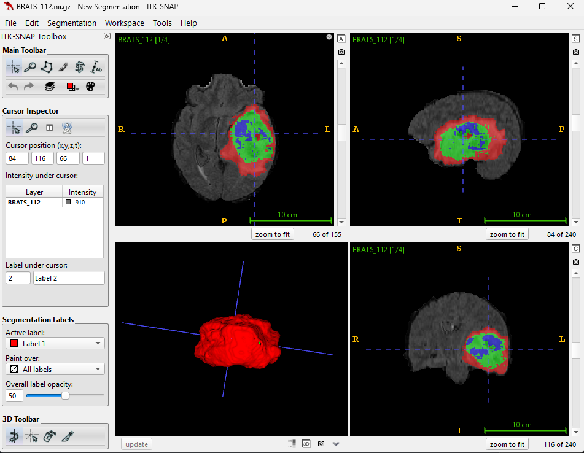
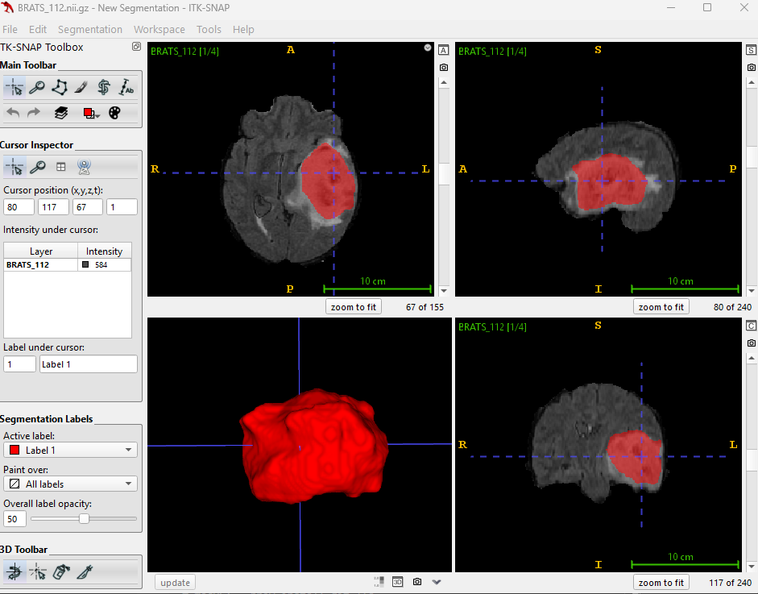
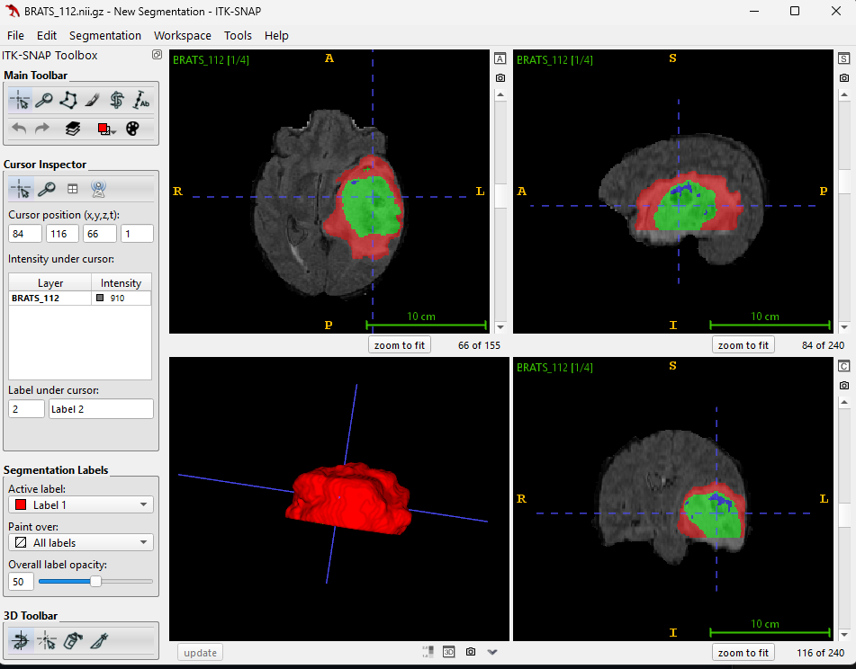

# Brain Tumor Detector — U-Net vs U-MambaNet (MONAI/PyTorch)

[]()
[]()
[]()
[]()

A reproducible 3D MRI brain-tumor segmentation pipeline comparing a strong **U-Net** baseline with a **U-MambaNet** (state-space) variant.  
Includes training, inference, and a gallery of overlays (ground truth vs. predictions).

---

## 🔎 Overview
- **Goal:** segment brain tumors on 3D MRI (BraTS-style) and compare U-Net vs U-MambaNet fairly.
- **Stack:** PyTorch + MONAI, AMP (mixed precision), sliding-window training/inference.
- **Report:** Bearcat AI Grant mid-project update (Nov 2025).

## Repo map
```bash
Repo map (key files)
├─ train.py               # main training entry
├─ engine.py              # training/eval loop utils
├─ model_builder.py       # U-Net wrapper
├─ U_Mamba_net.py         # U-MambaNet model
├─ U_Mamba_blocks.py      # SSM/Mamba blocks
├─ U_Net_predict.py       # inference: U-Net
├─ U_Mamba_predict.py     # inference: U-MambaNet
├─ preprocess.py          # orientation/spacing + intensity norm
├─ RepeatChannel.py       # channel utilities
├─ requirements.txt
└─ assets/
   ├─ figs/               # overlays & screenshots
   └─ media/              # demo .gif/.mp4 (tracked with Git LFS)
```


---

## 🚀 Quick Start
```bash
# 1) create env (example)
conda create -n tumor python=3.10 -y && conda activate tumor
pip install -r requirements.txt

# 2) train (choose your model)
python train.py --model unet         # or --model u_mamba
# add your flags: --epochs, --roi, --batch, --amp, etc.

# 3) run inference
python U_Net_predict.py       --input <path_to_volume> --output outputs/
python U_Mamba_predict.py     --input <path_to_volume> --output outputs/
```

<table>
  <tr>
    <td><b>Ground Truth (Case 112)</b><br>
      
    </td>
    <td><b>U-Net Pred (Case 112)</b><br>
      
    </td>
    <td><b>U-MambaNet Pred (Case 112)</b><br>
      
    </td>
  </tr>
</table>


<video width="720" controls>
  <source src="assets/media/demo_video_mid_project.mp4" type="video/mp4">
</video>


Dang Luu, "Brain Tumor Detector — U-Net vs U-MambaNet," 2025.


---

## Tips for great visuals

- **Consistency:** same slice index and color map across GT/U-Net/U-Mamba panels.  
- **Dimensions:** keep PNGs ≤ 1400px width and GIFs ≤ 15s to avoid heavy pages.  
- **Alt text:** set good `alt` text in `` for accessibility.  
- **Relative paths:** use `assets/...` so images work on all branches/forks.  
- **ITK-SNAP screenshots:** hide toolbars/cursors; export with a neutral background; consider overlay opacity 0.4–0.6 and a consistent label palette.
